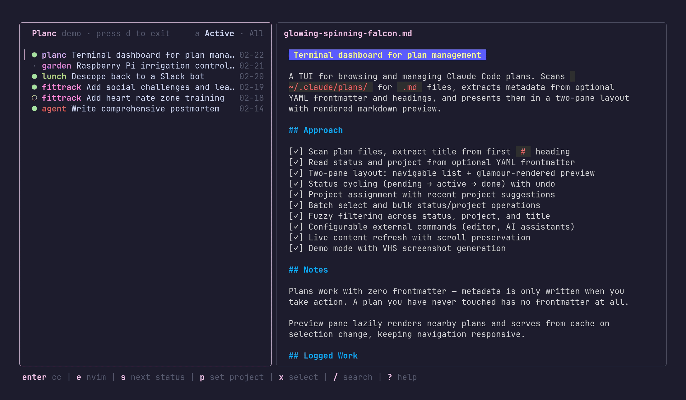

# planc

A tiny TUI for browsing and annotating your [Claude Code](https://docs.anthropic.com/en/docs/claude-code) plans.



Claude Code generates plan files with wonderfully unguessable names like `humming-marinating-narwhal.md`. `planc` scans your plans directory, shows them in a navigable list with a rendered markdown preview, and lets you open plans in Claude, your editor, or whatever else you've got — without ever leaving the terminal. You can annotate plans with inline comments, organize them with statuses and labels, and pull in plans from project directories alongside the central agent plans folder.

## Install

```
go install github.com/jakebf/planc@latest
```

Or clone and build:

```
git clone https://github.com/jakebf/planc.git
cd planc && go build
```

## Quick start

1. Run `planc`
2. On first launch it'll ask you to configure your commands, then you're off

That's it. `planc` scans `~/.claude/plans/` for `.md` files automatically. You can also configure a glob pattern to pull in plans from project directories (see [Configuration](#configuration)). Plans update live as Claude works on them.

## How it works

`planc` reads each `.md` file in your plans directory and extracts:

- **Title** from the first `# ` heading
- **Date** from the file's creation time
- **Status** and **labels** from optional YAML frontmatter

Plans work with zero frontmatter. Metadata is only written when you take action — setting a status with `s` or adding labels with `l`.

By default, only plans with a status (`reviewed` or `active`) are shown, plus any untagged plans modified after you first ran `planc`. Older pre-existing files stay hidden until you tag them. Press `a` to toggle visibility of done plans.

`planc` watches the plans directory (and any project plan directories) for changes. When another process (like Claude Code) edits a plan file, the preview updates automatically with scroll position preserved.

### Comment mode

Press `enter` on a plan to open comment mode. The left pane shows a table of contents built from the plan's headings, and the right pane shows the rendered markdown. Navigate headings with `j`/`k` — the preview scrolls to match.

Press `enter` on a heading to add an inline comment (a `> **[comment]:**` blockquote inserted after the heading). Press `enter` on an existing comment to edit it, or `d` to delete it. Comments are written directly into the markdown file, so they're visible to Claude Code and any other tool that reads the plan.

Use `n`/`p` to jump to the next or previous plan without leaving comment mode. Press `esc` to return to the plan list.

### Frontmatter format

```yaml
---
status: active
labels: backend, auth
---
```

Status values: `new` (unset), `reviewed`, `active`, `done`. Press `s` to pick from a modal or `0-3` to set directly.

Labels are comma-separated tags for organizing plans. Press `l` to open the label modal, where you can toggle existing labels or type a new one. Use `[`/`]` to filter the plan list by label.

Only non-default fields are written. A plan you've never touched has no frontmatter at all. Plans are sorted by file creation time (newest first).

### Teaching Claude Code about frontmatter

If you want Claude Code to set plan statuses automatically, add something like this to your `~/CLAUDE.md`:

```
Plan files in ~/.claude/plans/ can include YAML frontmatter.
Use:
- status: reviewed | active | done
- labels: comma-separated tags (e.g. backend, auth)
When creating a plan, set status: reviewed.
When starting work, set status: active.
When finished, set status: done.

You can add inline comments to plan files using blockquotes:
> **[comment]:** Your annotation here
Place these after any heading to attach a comment to that section.
```

## Configuration

On first run, `planc` walks you through setup. Re-run anytime with `planc --setup`. Config lives at:

- **Linux**: `~/.config/planc/config.json`
- **macOS**: `~/Library/Application Support/planc/config.json`
- **Windows**: `%AppData%\planc\config.json`

```json
{
  "plans_dir": "~/.claude/plans",
  "project_plans_glob": "~/code/**/plans",
  "primary": ["claude"],
  "editor": ["code"],
  "prompt_prefix": "Read this plan file and review any comments: ",
  "editor_mode": "background"
}
```

| Field | Description |
|-------|-------------|
| `plans_dir` | Path to the agent plans directory (default: `~/.claude/plans`) |
| `project_plans_glob` | Optional glob pattern for project plan directories (supports `**`). Plans found here appear alongside agent plans. |
| `primary` | Command run with `c` (coding agent) |
| `editor` | Command run with `e` (editor) |
| `prompt_prefix` | Prefix prepended to the plan path when passed to the primary command |
| `editor_mode` | `"background"` (default for GUI editors) or `"foreground"` (default for vim/nvim/nano/etc.) |
| `show_all` | Persist the done-plan visibility toggle across sessions |

If a command includes `{file}`, it is replaced with the selected plan path. If `{file}` is not present, `planc` appends the plan path as the last argument. For the primary command, the appended path is prefixed with the configurable `prompt_prefix` so AI assistants get context. Edit the config file directly or run `planc --setup` to reconfigure.

`planc` checks for updates once a day at startup.

## Keybindings

### Plan list

| Key | Action |
|-----|--------|
| `j`/`k` | Navigate list / scroll preview |
| `tab` / `←`/`→` | Switch panes |
| `enter`/`o` | Open comment mode (ToC + annotations) |
| `e` | Open in editor |
| `c` | Open in coding agent |
| `s` | Status (pick from modal) |
| `0-3` | Set status directly (0=new, 1=reviewed, 2=active, 3=done) |
| `~` | Cycle status |
| `u` | Undo last status change (3s window) |
| `l` | Labels (toggle/add in modal) |
| `[`/`]` | Cycle label filter |
| `a` | Toggle done plans |
| `x` | Select (batch mode) |
| `C` | Copy file path to clipboard |
| `space`/`B` | Page down / page up (preview pane) |
| `/` | Search |
| `#` | Delete (with confirmation) |
| `D` | Demo mode |
| `?` | Help |
| `,` | Settings |
| `q` | Quit |

### Comment mode

| Key | Action |
|-----|--------|
| `j`/`k` | Navigate headings (ToC pane) / scroll (preview pane) |
| `tab` / `←`/`→` | Switch between ToC and preview |
| `enter` | Add comment on heading / edit existing comment |
| `d` | Delete comment under cursor |
| `s`/`l` | Set status / labels (without leaving comment mode) |
| `n`/`p` | Next / previous plan file |
| `e` | Open in editor |
| `esc` | Back to plan list |

## License

[MIT](LICENSE)
